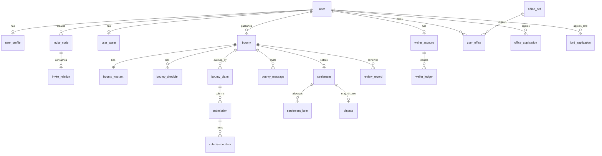
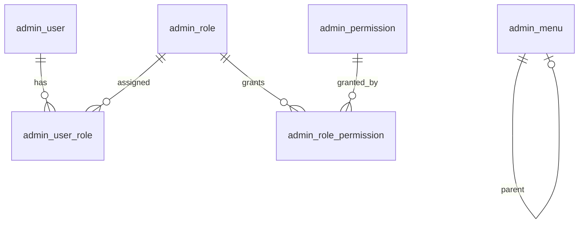

# 系统架构文档（Architecture）

> 由 **架构师 AI（@architect）** 维护。输入：`docs/requirements.md`（**v1.8.0**）。

**版本**：v1.0.4  
**状态**：已确认（可进入后端/前端实现）  
**最后更新**：2026-08-05  
**变更说明**：v1.0.4 对齐需求 v1.8.0：再发一令（复制新建、`source_bounty_id`、终态约束）。

---

## 1. 技术栈

| 层级 | 选型 | 说明 |
|------|------|------|
| 后端 | Java 17 + Spring Boot 3.x | 业务 API + 定时任务（单体） |
| ORM | MyBatis-Plus | 列表/后台查询友好 |
| 前端 | Vue 3 + Vite + TypeScript | Web 响应式；单工程三区路由 |
| UI | 侠士端自定义主题；执事堂/武林盟后台 Element Plus | C 端品牌感；后台效率 |
| 数据库 | MySQL 8 | 主数据 + 账本流水 |
| 缓存 | Redis | 验证码、日揭榜计数、提交限流、JWT 黑名单、英雄谱缓存 |
| 鉴权 | JWT（Access Token）+ Redis 黑名单；可选 Refresh | 统一 `Authorization: Bearer` |
| 文件 | 本地磁盘 + `FileStorage` 抽象 | 探子清单图片；P1 可换 MinIO/OSS |
| 短信 | MockSmsAdapter（验证码写日志/可配固定码） | 接口预留真实厂商 |
| 支付 | MockWallet（模拟银两） | 不接真实支付 |
| 异步 | Spring `@Scheduled` + DB 扫描 | 无需 MQ |
| 部署 | Docker Compose | frontend / backend / mysql / redis |

**MVP 明确不做**：独立 API 网关、Kafka/RabbitMQ、微服务拆分、WebSocket 即时聊天、真实短信/支付、搜索引擎。

---

## 2. 服务拆分

### 2.1 总体形态

```
侠士端(/) ──┐
执事堂(/hall) ─┼→ Vue SPA → /api/v1/** → Spring Boot 单体 → MySQL / Redis / 本地文件
武林盟(/admin)─┘
```

- **后端**：单一 Spring Boot 进程，按包（领域模块）划分边界，共享同一事务与数据库。
- **前端**：单一 Vue 工程，路由分区 + 权限守卫；三区共享鉴权与基础组件，菜单/能力强隔离。

### 2.2 后端领域模块

| 模块包 | 职责 | 依赖 |
|--------|------|------|
| `auth` | 邀请注册、验证码/密码登录、JWT 签发与校验 | user, Redis |
| `user` | 侠士资料、实名占位、启用/封禁状态 | DB |
| `wallet` | 模拟钱庄：余额、冻结、结算、退款、发放类入账、提现（可关）、调账、流水 | DB（账本） |
| `bounty` | 悬赏令、结构化令状、状态机、揭榜、探子清单快照 | user, wallet, cms |
| `collab` | 悬赏会话消息、成果提交与版本 | bounty |
| `review` | 发令审核、成果审核、回避、管理员改判 | bounty, office, collab |
| `settle` | 完结分配（90% 分完）、服务费、互评入口 | bounty, wallet, growth |
| `dispute` | 7 日纠纷、举证、终裁执行 | settle, wallet |
| `growth` | 侠义值/体力/等级/声望公式、兑换体力与奖品 | user, cms |
| `rank` | 英雄谱三榜、盟主荣耀位 | growth, user |
| `office` | 职司定义、申请、任期、执事堂授权 | user, growth |
| `cms` | 告示栏、赏银档位、清单模板、系统参数、等级配置 | DB |
| `admin` | 后台 RBAC、工作台聚合、运营管理入口 | 各模块只读/编排 |
| `notify` | 站内消息（提醒、审核结果、仲裁结果） | DB |
| `job` | 超时取消、截止提醒、英雄谱刷新、体力重置、职司到期 | 各业务服务 |
| `file` | 上传下载、本地存储实现 | 磁盘 |

**依赖原则**：

1. `bounty` / `settle` / `dispute` **只能通过 `wallet` 账本服务动钱**，禁止直接改余额字段。
2. 职司权限（L1）与管理员 RBAC（L0）**分表、分拦截器**；任何配置不得把 L0 授给侠士。
3. 配置类参数统一走 `sys_config` / 专用配置表，运行时可读缓存。

### 2.3 前端路由分区

| 区 | 路径前缀 | 用户 | 说明 |
|----|----------|------|------|
| 侠士端 | `/` | 注册侠士 | 广场、发令、揭榜、钱庄、英雄谱、申请入口等 |
| 执事堂 | `/hall` | 持有效职司的侠士 | 令审使/验功使待审队列；不可见 L0 |
| 武林盟后台 | `/admin` | 管理员账号 | 完整运营后台；独立登录入口可共用或分离 |

---

## 3. 数据库设计

### 3.1 ER 概要



### 3.2 核心表

#### 3.2.1 账户与成长

| 表名 | 说明 | 关键字段 / 索引 |
|------|------|------------------|
| `user` | 侠士/可扩展类型 | `id`, `phone`, `username`, `password_hash`, `status`, `city`; UK(`phone`), UK(`username`) |
| `user_profile` | 昵称头像简介、实名状态占位 | `user_id`, `nickname`, `avatar_url`, `bio`, `real_name_status` |
| `invite_code` | 邀请码 | `code`, `owner_user_id`, `quota`, `used_count`, `status`, `expire_at`; UK(`code`) |
| `invite_relation` | 邀请关系 | `inviter_id`, `invitee_id`, `invite_code_id`; UK(`invitee_id`) |
| `wallet_account` | 钱庄账户 | `user_id`, `balance`, `frozen`, `version`（乐观锁）; UK(`user_id`) |
| `wallet_ledger` | 不可改流水 | `biz_no` UK, `user_id`, `type`, `amount`, `balance_after`, `frozen_after`, `ref_type`, `ref_id`, `remark` |
| `user_asset` | 侠义/体力等 | `user_id`, `chivalry`(侠义值), `stamina`, `completed_orders`, `good_rate`, `reputation_score`; UK(`user_id`) |
| `user_level_config` | 等级阈值配置 | `level`, `title`, `min_chivalry`, `privileges_json` |
| `login_log` | 登录日志 | `user_id`/`admin_id`, `ip`, `user_agent`, `result`, `created_at` |

#### 3.2.2 悬赏与协作

| 表名 | 说明 | 关键字段 / 索引 |
|------|------|------------------|
| `bounty` | 悬赏令主表 | `publisher_id`, `type`(求租/出租), `title`, `status`, `city`, `district`, `difficulty`, `reward_amount`, `deadline_at`, `task_tags_json`, `frozen_biz_no`, **`source_bounty_id`**（可空，再发来源）；IDX(`status`,`city`,`deadline_at`)；IDX(`source_bounty_id`) |
| `bounty_warrant` | 结构化令状快照 | `bounty_id`, `template_code`, `fields_json`（见 §3.2.2.1） |
| `bounty_checklist` | 本单探子清单快照 | `bounty_id`, `item_code`, `item_name`, `required`, `sort` |
| `bounty_claim` | 揭榜关系 | `bounty_id`, `user_id`, `stamina_cost`, `status`; **UK(`bounty_id`,`user_id`)** |
| `bounty_message` | 协作会话消息 | `bounty_id`, `sender_id`, `content`, `created_at`; IDX(`bounty_id`,`id`) |
| `submission` | 成果提交版本 | `claim_id`, `version_no`, `status`(待审/通过/驳回), `content_summary` |
| `submission_item` | 按清单项填写 | `submission_id`, `checklist_item_code`, `done`, `text`, `media_urls_json` |
| `review_record` | 审核记录 | `target_type`(BOUNTY/SUBMISSION), `target_id`, `result`, `reason`, `reviewer_id`, `reviewer_role`, `override_by` |
| `settlement` | 结算单 | `bounty_id`, `reward_b`, `fee`, `distributable`, `status` |
| `settlement_item` | 分配明细 | `settlement_id`, `user_id`, `amount`, `chivalry_bonus` |
| `evaluation` | 互评 | `bounty_id`, `from_user_id`, `to_user_id`, `score`, `content`; UK(`bounty_id`,`from_user_id`,`to_user_id`) |
| `dispute` | 纠纷 | `settlement_id`, `bounty_id`, `initiator_id`, `status`, `evidence_json`, `verdict_json`, `deadline_at` |

**悬赏状态枚举（与需求 6.9 对齐）**：

| 状态 | 码 | 说明 |
|------|-----|------|
| 待审核 | `PENDING_REVIEW` | 已冻结赏银，未上架 |
| 张贴中 | `OPEN` | 可揭榜 |
| 协作中 | `IN_COLLAB` | 至少 1 人揭榜后进入（首揭自动流转） |
| 待结算 | `PENDING_SETTLE` | 令主发起完结前准备态（可选，或完结时直接结算） |
| 已完结 | `COMPLETED` | 结算成功 |
| 审核驳回 | `REJECTED` | 解冻退回 |
| 已取消 | `CANCELLED` | 含超时退款 |
| 纠纷中 | `IN_DISPUTE` | 冻结结算结果待裁决 |

##### 3.2.2.1 令状 `fields_json` 约定（相对 v1.0 增量）

发令主信息与结构化令状分离存储，避免字段职责重叠：

| 层级 | 存放 | 示例 |
|------|------|------|
| 悬赏主信息 | `bounty` 表列 / 创建 API 顶层 | `title`、`type`、`difficulty`、`taskTags`、`rewardAmount`、`deadlineAt` |
| 结构化令状 | `bounty_warrant.fields_json` | 区域、租金预算/租金、户型、入住日、是否接受中介等 |
| 探子清单 | `bounty_checklist` 快照 | 验核项，**不是**发令自由文本 |

**自由文本（需求 v1.6.1 → v1.6.2）**：

| 项 | 约定 |
|----|------|
| 存储 key | **`extra`**（唯一） |
| 展示名 `label` | **补充说明**（定稿；**禁止**使用「令外叮嘱」） |
| 必填 | 否 |
| 用途 | 结构化填不下的额外交代（通勤、宠物、楼层、忌西晒、联系时段等） |
| 展示 | 发令页始终展示；详情页空值可隐藏 |
| 禁止平行 key | 不得再引入 `remark` / `note` / `description` / `otherRequirements` / `需求说明` 等同义自由文本键 |

模板权威源：运行时 `GET /meta/warrant-templates` 的 `key`/`label`；字段级契约见 `docs/api.md` §5.2。  
探子清单项「周边配套备注」属**验核交付**，与 `extra`（发令需求补充）职责不同，勿合并。

#### 3.2.3 治理与运营

| 表名 | 说明 |
|------|------|
| `office_def` | 职司定义（令审使/验功使）、门槛等级、名额、任期天 |
| `user_office` | 用户职司实例：状态 ACTIVE/SUSPENDED/EXPIRED、起止时间 |
| `office_application` | 职司申请单 |
| `lord_application` | 武林盟主申请单 |
| `platform_lord` | 现任盟主（全局一行或配置键） |
| `notice` | 告示栏 |
| `checklist_template` | 探子清单库 + 标签映射 |
| `reward_suggest_config` | 最低赏银与难度建议区间 |
| `reward_product` / `redeem_order` | 奖品与兑换订单 |
| `rank_snapshot` | 英雄谱物化快照（声望/侠义/完令） |
| `sys_config` | 系统参数（揭榜日限、体力、费率、提醒等） |
| `site_message` | 站内消息（`read_flag` + IDX(`user_id`,`read_flag`,`id`) 支撑未读计数） |
| `admin_user` / `admin_role` / `admin_permission` / `admin_role_permission` / `admin_user_role` / `admin_menu` | 后台 RBAC（见 §3.2.4） |
| `audit_log` | 敏感操作审计 |

#### 3.2.4 管理员 RBAC 表结构（D-003）



| 表名 | 说明 | 关键字段 / 约束 |
|------|------|------------------|
| `admin_user` | 后台账号 | `id`, `username` UK, `password_hash`, `display_name`, `status`(`ACTIVE`/`DISABLED`), `created_at`, `updated_at` |
| `admin_role` | 角色 | `id`, `code` UK（`SUPER_ADMIN`/`OPS_ADMIN`/`ARBITER`/`OBSERVER`）, `name`, `builtin` TINYINT, `description`, `status` |
| `admin_permission` | 权限码字典 | `id`, `code` UK（如 `user:read`）, `name`, `module`, `type`(`API`/`MENU`/`BUTTON`) |
| `admin_role_permission` | 角色↔权限 | `role_id`, `permission_id`；**UK(`role_id`,`permission_id`)** |
| `admin_user_role` | 账号↔角色 | `admin_id`, `role_id`；**UK(`admin_id`,`role_id`)** |
| `admin_menu` | 菜单树 | `id`, `parent_id`(0=根), `type`(`DIR`/`MENU`/`BUTTON`), `name`, `path`, `component`, `icon`, `sort`, `visible`, `permission_code`, `status` |

**种子与规则**：

1. 预置四角色；`SUPER_ADMIN` → 权限仅存一条 code=`*`（或运行时短路为全放行，库中可存 `*` 对应 permission 行）。  
2. `OPS_ADMIN` / `ARBITER` / `OBSERVER` 默认权限集见 `api.md` §16.0.2；**禁止**写入 `*`。  
3. 至少 1 个超管账号；删除/降权时校验「系统仍有 ACTIVE 超管」。  
4. 有效权限 = 用户所有角色权限码并集；含 `*` 则全量。  
5. 菜单可见性：节点 `permission_code` 为空则登录即可；非空则需持有该码或 `*`。  
6. L0 RBAC 表与侠士 `user_office` **物理隔离**，无外键互通。

### 3.3 钱庄账本约定

| 流水类型 `type` | 方向 | 说明 |
|-----------------|------|------|
| `REGISTER_GRANT` | +余额 | 注册赠银（默认 500；`biz_no=REG_GRANT:{userId}`） |
| `INVITE_REWARD` | +余额 | 邀新奖励入邀请人（默认 100；`biz_no=INV_REWARD:{inviteeId}`，同邀请人关系一次） |
| `RECHARGE` | +余额 | 模拟充值（须 `wallet.rechargeEnabled=true`） |
| `FREEZE` | 余额→冻结 | 发令托管 |
| `UNFREEZE_REFUND` | 冻结→余额 | 驳回/超时/取消退款 |
| `SETTLE_PAY` | -冻结 | 结算扣托管 |
| `SETTLE_INCOME` | +余额 | 揭榜人入账 |
| `PLATFORM_FEE` | 平台账户 + | 服务费 10% |
| `WITHDRAW` | -余额 | 模拟提现（须 `wallet.withdrawEnabled=true`） |
| `ADJUST` | ± | 管理员手工调账/发放（必审记） |

- 业务幂等键：`biz_no` 全局唯一；同一业务动作重试不重复入账。
- 账户用 `version` 乐观锁；资金变更与业务状态同一本地事务。
- **注册路径**：创建用户 + 开户 + `REGISTER_GRANT`（+ 可选 `INVITE_REWARD`）+ 站内消息，同一本地事务。
- **MVP 开关**（`sys_config`，默认 false）：`wallet.rechargeEnabled`、`wallet.withdrawEnabled`；关闭时 C 端隐藏入口，用户 API 返回 `42004`，**接口不删**。金额可配：`wallet.registerGrantAmount`（500）、`wallet.inviteRewardAmount`（100）。

### 3.4 结算公式（落库快照）

- 托管赏银 `B` = 令主冻结金额  
- 平台服务费 = `B × 0.10`（费率可配置，默认 10%）  
- 可分配池 = `B × 0.90`  
- 提交结算前校验：`Σ(分配金额) == 可分配池`；允许单项 `0`；可选侠义值奖励不从赏银折算。

---

## 4. 部署方案

- 编排目录：`docker/`；说明文档：`docs/deployment.md`
- Compose 服务：`frontend`、`backend`、`mysql`、`redis`
- 配置与密钥：`.env`（不入库）；提供 `.env.example`
- 文件卷：挂载 `UPLOAD_DIR` 持久化探子清单图片
- 健康检查：Spring Actuator `/actuator/health`
- 网关：MVP 由前端 Nginx 反代 `/api` → backend，不单独部署网关进程

详见 [deployment.md](./deployment.md)。

---

## 5. 安全与鉴权

### 5.1 认证

| 端 | 方式 |
|----|------|
| 侠士 | 手机验证码 **或** 账号密码；注册须有效邀请码 |
| 管理员 | 独立后台账号密码登录（可与侠士账号体系分离表） |
| Token | JWT Access；登出/封禁写入 Redis 黑名单 |

短信验证码：Mock 适配器；Redis 存码与发送频控。

### 5.2 授权模型（三层）

| 层级 | 名称 | 载体 | API 前缀 |
|------|------|------|----------|
| L0 | 核心权限 | `admin_*` RBAC（超管/运营/终裁仲裁员/观察者） | `/api/v1/admin/**` |
| L1 | 治理权限 | `user_office`（令审使/验功使） | `/api/v1/hall/**` |
| L2 | 基础权限 | 正常侠士 `user` | `/api/v1/**`（非 admin/hall） |

**L0 不可下放**（代码硬校验）：系统参数与费率、钱庄调账、永久封禁终裁、职司授撤、盟主任免终审、纠纷终裁、管理员账号与菜单、完整敏感导出。

**职司回避**：不可审核本人发布的令、本人揭榜的令（服务端强制）。

#### 5.2.1 管理员 RBAC 拦截（对齐 api §16.0.4）

| 步骤 | 行为 |
|------|------|
| 1 | 解析 JWT，`PrincipalType=ADMIN`；否则拒访 `/admin/**` |
| 2 | 加载 `admin_user` 状态 + 角色权限并集（可缓存于请求上下文；角色变更后旧 Token 仍可用至过期，或权限热加载） |
| 3 | 方法所需权限码 ∈ 并集 **或** 并集含 `*` → 放行；否则 **`40300`** |
| 4 | `*` **仅**允许出现在 `SUPER_ADMIN` 角色；其它角色配置校验拒绝 |
| 5 | 登录/`me`/`logout` 不做业务权限码校验 |

实现建议：注解 `@RequireAdminPerm("bounty:review")` + 路径默认映射表；与 L1 `hall` 拦截器分离。

### 5.3 敏感数据

- 密码 BCrypt；JWT 密钥环境变量注入  
- 实名信息最小化存储，后台按角色可见  
- 模拟资金全链路标识「模拟银两 / 非真实货币」  
- 调账、授撤职司、盟主任免、强制下架、仲裁终裁 → 全量 `audit_log`

---

## 6. 非功能设计

### 6.1 缓存策略

| Key 模式 | 用途 | TTL |
|----------|------|-----|
| `sms:{scene}:{phone}` | 验证码 | 5 min |
| `claim:day:{yyyyMMdd}:{userId}` | 日揭榜次数 | 至次日 |
| `submit:cd:{claimId}` | 成果提交冷却 | 配置（默认 10 min） |
| `submit:day:{yyyyMMdd}:{userId}` | 日提交次数 | 至次日 |
| `jwt:blacklist:{jti}` | 登出/封禁 | 剩余有效期 |
| `rank:{type}` | 英雄谱缓存 | 与刷新任务对齐 |
| `config:*` | 系统参数 | 短 TTL + 变更失效 |

### 6.2 限流与体力

| 规则 | 实现 |
|------|------|
| 同令揭榜 1 次 | DB UK `(bounty_id,user_id)` |
| 日揭榜 ≤10 | Redis 计数 + DB 校验 |
| 揭榜耗体力 | 事务内扣 `user_asset.stamina` |
| 每日免费体力补足 | 定时或懒重置至配置值（默认 5）；已高于则不削 |
| 成果冷却/日限/短时窗 | Redis + `sys_config` |

### 6.3 消息 / 异步

- **不做 MQ**；站内消息落 `site_message`，前端登录后拉未读数 + 可短轮询；进入列表/详情拉取正文。
- **未读角标**：`GET /messages/unread-count` → `COUNT(*) WHERE user_id=? AND read_flag=0`；标记已读更新 `read_flag`。
- 协作会话：`bounty_message` + REST 分页拉取（P1 可升级 WebSocket）。

### 6.4 定时任务

| 任务 | 建议频率 |
|------|----------|
| 截止提醒 T-24h / T-2h | 每 5–10 分钟 |
| 超时自动取消并全额退款 | 每 1 分钟 |
| 英雄谱刷新 | 每 10 分钟 |
| 体力日重置 | 每日 0 点（或懒重置） |
| 职司任期到期标记 | 每日 |

### 6.5 观测性

- 应用日志：结构化 JSON（可选）+ 请求 traceId  
- Actuator：health、info；指标可后续接 Prometheus  
- 后台可查看任务执行摘要（P0 建议：最近成功/失败时间写入表或日志）

### 6.6 扩展点

| 扩展点 | 接口/抽象 | MVP 实现 | 后续 |
|--------|-----------|----------|------|
| 短信 | `SmsSender` | Mock | 阿里云/腾讯云 |
| 支付 | `PaymentGateway` | Mock 充值 | 微信/支付宝 |
| 文件 | `FileStorage` | Local | MinIO/OSS |
| 令状校验 | 模板驱动 JSON Schema | 求租/出租两套 | 多品类 |
| 声望公式 | 配置表达式/参数 | 完成单×10+好评率×100 | 加权推荐 |

---

## 7. 关键业务流程（架构视角）

### 7.1 发令托管

1. 校验令状必填、赏银 ≥ 最低（默认 200）、低于建议下限则要求 `confirmLowReward=true`  
2. `wallet.freeze(B)` → 写流水 → 创建 `bounty`=`PENDING_REVIEW` + 令状/清单快照  
3. 审核通过 → `OPEN`；驳回 → `UNFREEZE_REFUND` + `REJECTED`

### 7.2 揭榜

校验：非本人、状态可揭榜、未揭过、日次数、体力 → 扣体力 → 写 `bounty_claim` → 日计数 +1 → 若原 `OPEN` 则转 `IN_COLLAB`。  
**不发放侠义值、不增加完成单。**

### 7.3 成果与审核

限流通过后写入 `submission` + items → `PENDING` → 验功使/管理员审核；仅通过可作为结算有效贡献与侠义依据。

### 7.4 结算

令主提交分配方案 → 校验分完 → 账本：扣冻结、分账入账、记平台服务费 → `COMPLETED` → 开放互评 → 更新完成单/好评率/声望 → 按规则发侠义值。

### 7.5 超时与纠纷

- 超时：`CANCELLED` + 全额解冻退回  
- 结算后 7 日内可纠纷 → `IN_DISPUTE` → 管理员终裁执行资金调整

### 7.6 注册赠银与邀新（v1.7）

1. 注册事务内：开 `wallet_account` → `REGISTER_GRANT` 入账新用户 →（若有邀请人）`INVITE_REWARD` 入账邀请人 → 写 `site_message`。  
2. 幂等靠 `biz_no`；重复注册请求不得二次入账。  
3. 充值/提现开关关闭不影响发放类与托管结算。

### 7.7 再发一令（v1.8）

1. 校验：当前用户 = 原令主；原 `status ∈ {REJECTED,CANCELLED,COMPLETED}`；否则拒绝。  
2. **新建** `bounty`（新 ID），`source_bounty_id = 原 id`；复制主信息/令状/清单快照（允许请求覆盖赏银、截止、标题等）；**不**复制揭榜/会话/成果/评价。  
3. `wallet.freeze(新赏银)` → 新单 `PENDING_REVIEW`。  
4. **原单状态与资金不动**（禁止把终态改回待审/张贴中）。

---

## 8. 架构决策记录（ADR）

| ID | 决策 | 选项 | 结论 | 理由 |
|----|------|------|------|------|
| ADR-01 | 服务形态 | 微服务 / 模块化单体 | **模块化单体** | 试点规模小；资金与状态机强一致 |
| ADR-02 | 前端形态 | 双工程 / 单工程三区 | **单 Vue + `/` `/hall` `/admin`** | 共享鉴权与组件；菜单隔离即可 |
| ADR-03 | 钱庄 | 直接改余额 / 账本+流水 | **账本 + biz_no 幂等** | 防重放、可审计、可对账 |
| ADR-04 | 协作会话 | WebSocket / REST 消息表 | **REST 消息表** | MVP 优先主闭环；P1 可升级 |
| ADR-05 | 短信/支付 | 真实对接 / Mock | **全程 Mock** | 需求明确模拟钱庄；降低首发依赖 |
| ADR-06 | ORM/后台 UI | JPA / MyBatis-Plus；自研 / Element | **MyBatis-Plus + Element Plus** | 后台列表多；交付效率 |
| ADR-07 | 异步 | MQ / Scheduled | **Scheduled + DB 扫描** | 任务种类少、量级小 |
| ADR-08 | 管理员账号 | 与侠士同表 / 分表 | **admin 分表** | L0 与 C 端隔离更清晰 |
| ADR-09 | 英雄谱 | 实时算 / 物化快照 | **定时物化 + Redis 缓存** | 读多写少、列表稳定 |
| ADR-10 | 令状自由文本 | 多备注字段 / 单一 `extra` | **单一 key=`extra`，label=补充说明** | 需求 v1.6.2；防与清单备注、主标题职责重叠 |
| ADR-11 | 管理员通配符 `*` | 全员 `*` / 废除 `*` / 仅超管 | **保留 `*`，仅 `SUPER_ADMIN`** | 修复 D-003；运维简单且多角色可验 |
| ADR-12 | MVP 银两入口 | 删除充值提现 / 永久隐藏 / 配置开关 | **配置开关默认关，接口保留** | 需求 v1.7.1；后续真实支付可再开 |
| ADR-13 | 终态再发 | 原单复活 / 复制新建 | **复制新建 + `source_bounty_id`** | 需求 v1.8；审计清晰、资金隔离 |

---

## 9. 与需求追溯

| 需求块 | 架构落点 |
|--------|----------|
| P0-A 侠士端闭环 | auth/user/wallet/bounty/collab/settle/growth/rank/office/cms/notify |
| P0-B 武林盟完整后台 | admin + 各模块管理 API |
| 权限 L0/L1/L2 | admin RBAC / hall office / user |
| 管理员四角色 RBAC（D-003） | §3.2.4 + §5.2.1；契约 api §16.0～16.10 |
| 租房令状 + 赏银建议 + 探子清单 + 告示栏 | bounty + cms |
| 令状自由文本「补充说明」(`extra`) | `bounty_warrant.fields_json.extra` + meta 模板 label |
| 模拟钱庄与 10% 服务费 | wallet + settle |
| 注册赠银 / 邀新奖励 / 充提开关（v1.7） | §3.3 + §7.6；api §2.3、§4 |
| 消息未读角标（v1.7） | §6.3；api §14.2 |
| 再发一令（v1.8） | §7.7；`bounty.source_bounty_id`；api §7.8 |

接口契约见 [api.md](./api.md)。部署见 [deployment.md](./deployment.md)。

---

## 10. 变更记录

| 版本 | 日期 | 相对上一版差异 |
|------|------|----------------|
| v1.0 | 2026-08-05 | 初版：模块化单体、三区前端、账本钱庄、对齐需求 v1.6 |
| v1.0.1 | 2026-08-05 | **对齐需求 v1.6.1/v1.6.2**：① 新增 §3.2.2.1 令状 `fields_json` 约定；② 自由文本唯一 key=`extra`，label=**补充说明**（废弃「令外叮嘱」文案）；③ 明确主信息 vs 令状 vs 探子清单边界，禁止平行备注 key；④ ADR-10；⑤ `bounty` 表关键字段补 `title`/`task_tags_json` |
| v1.0.2 | 2026-08-05 | **D-003 管理员 RBAC**：① 新增 §3.2.4 六表结构与种子规则；② §5.2.1 拦截策略；③ ADR-11（`*` 仅超管）；④ 追溯表补四角色 |
| v1.0.3 | 2026-08-05 | **需求 v1.7.1**：① 流水增 `REGISTER_GRANT`/`INVITE_REWARD`；② 充提开关与 `42004`；③ 未读计数；④ §7.6 注册赠银流程；⑤ ADR-12 |
| **v1.0.4** | 2026-08-05 | **需求 v1.8.0**：① `bounty.source_bounty_id`；② §7.7 再发一令流程；③ ADR-13（复制新建禁止复活） |
